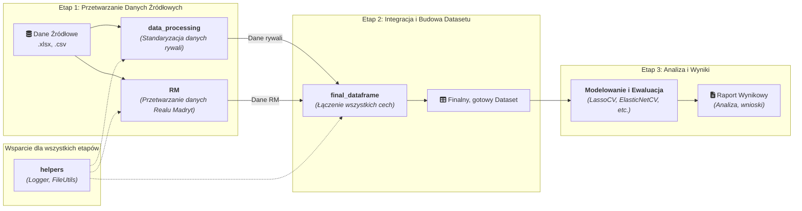

# 🏆 Model Predykcyjny Wyników Meczów Realu Madryt w La Liga

> Zaawansowany model statystyczny do przewidywania kursów bukmacherskich, zbudowany w oparciu o unikalne, wielowymiarowe dane z ostatnich pięciu sezonów, w tym eksperckie oceny pomeczowe.

[](https://www.python.org/)
[](https://pandas.pydata.org/)
[](https://scikit-learn.org/)
[](./)

---

## 📋 Spis Treści

- [🏆 Model Predykcyjny Wyników Meczów Realu Madryt w La Liga](#-model-predykcyjny-wyników-meczów-realu-madryt-w-la-liga)
  - [📋 Spis Treści](#-spis-treści)
  - [🎯 Cel Projektu](#-cel-projektu)
  - [🚀 Kluczowe Wyniki](#-kluczowe-wyniki)
  - [🏗️ Architektura i Przepływ Danych](#️-architektura-i-przepływ-danych)
  - [🧭 Przewodnik po Modułach Projektu](#-przewodnik-po-modułach-projektu)
    - [📊 Moduł `data_processing`](#-moduł-data_processing)
    - [⚪ Moduł `RM`](#-moduł-rm)
    - [🔗 Moduł `final_dataframe`](#-moduł-final_dataframe)
    - [🛠️ Moduł `helpers`](#️-moduł-helpers)
  - [🗄️ Struktura Danych](#️-struktura-danych)
    - [➡️ Zobacz szczegółową strukturę datasetu](#️-zobacz-szczegółową-strukturę-datasetu)
  - [⚙️ Instalacja i Uruchomienie](#️-instalacja-i-uruchomienie)
  - [⚠️ Ważna Informacja o Danych](#️-ważna-informacja-o-danych)
  - [✍️ Autor](#️-autor)

---

## 🎯 Cel Projektu

Głównym celem projektu było zaprojektowanie, zbudowanie i dogłębna ocena modeli uczenia maszynowego zdolnych do predykcji kursów bukmacherskich na zwycięstwo Realu Madryt. Model ma za zadanie dostarczyć obiektywną, opartą na danych ocenę realnych szans drużyny, stanowiąc zaawansowane narzędzie analityczne.

Fundamentem analizy są unikalne dane pochodzące z serwisu **RealMadryt.PL**, w szczególności **eksperckie, pomeczowe oceny redaktorów**, które okazały się kluczowym czynnikiem predykcyjnym.

---

## 🚀 Kluczowe Wyniki

Analiza wykazała wysoką skuteczność modeli liniowych z regularyzacją (LassoCV, ElasticNetCV), które okazały się bardziej stabilne i interpretowalne niż złożone architektury hybrydowe.

- **Współczynnik determinacji (R²): ~0.72** – Model jest w stanie wyjaśnić około 72% zmienności w kursach rynkowych.

- **Kluczowe czynniki predykcyjne:** Forma rywala, gra u siebie oraz **eksperckie oceny pomeczowe** z ostatnich 5 spotkań.
- **Ograniczenia:** Największe błędy predykcyjne pojawiają się w sytuacjach, gdzie kluczową rolę odgrywa trudny do zmierzenia **kontekst meczowy** (np. rotacje w składzie, stawka spotkania).

> **Szczegółowa analiza modeli, studium przypadków i wnioski biznesowe znajdują się w pełnym raporcie:**
>
>
> ### [➡️ Przeczytaj Raport z Analizy Modeli Predykcyjnych](src\modeling\notebooks\finall_model_report.md)

---

## 🏗️ Architektura i Przepływ Danych

Projekt został zaprojektowany w sposób modułowy, aby zapewnić czystość kodu, reużywalność i łatwość w utrzymaniu. Poniższy diagram przedstawia ogólny przepływ danych przez system.



---

## 🧭 Przewodnik po Modułach Projektu

Poniżej znajduje się opis kluczowych modułów projektu. Każdy z nich posiada szczegółową dokumentację techniczną, do której prowadzą odnośniki.

### 📊 Moduł `data_processing`

- **Cel:** Agregacja i przetwarzanie surowych danych o wszystkich meczach i rywalach Realu Madryt. Odpowiada za standaryzację nazw, nadawanie unikalnych ID oraz obliczanie fundamentalnych statystyk (np. PPM, odmarżowane kursy).
  
- [➡️ **Szczegółowa dokumentacja modułu `data_processing`**](DOCUMENT/SCRIPT/data_processing/data_processing.md)

### ⚪ Moduł `RM`

- **Cel:** Przetwarzanie i konsolidacja wszystkich danych związanych bezpośrednio z Realem Madryt. Moduł integruje dane drużynowe, szczegółowe statystyki indywidualne oraz unikalne dane ocenowe (redaktorów i użytkowników).

- [➡️ **Szczegółowa dokumentacja modułu `RM`**](DOCUMENT/SCRIPT/RM/RM.md)

### 🔗 Moduł `final_dataframe`

- **Cel:** Główny moduł orkiestrujący, którego zadaniem jest integracja danych z poprzednich etapów i budowa końcowego, płaskiego datasetu gotowego do modelowania. Składa się z logicznych podmodułów:
- **`opp_team`**: Ekstrakcja zaawansowanych statystyk o formie i sile przeciwników.
- **`rm_team`**: Obliczanie zagregowanych statystyk drużynowych dla Realu Madryt, w tym danych o trenerze.

- **`rm_h2h`**: Analiza historii bezpośrednich pojedynków (Head-to-Head).

- **`rm_players`**: Agregacja i przygotowanie szczegółowych danych o 16 zawodnikach z kadry meczowej.
  
- [➡️ **Dokumentacja podmodułu `opp_team`**](DOCUMENT\SCRIPT\finall_dataframe\final_dataframe.md)
- [➡️ **Dokumentacja podmodułu `rm_team`**](DOCUMENT\SCRIPT\finall_dataframe\rm_team-finall_dataframe.md)
- [➡️ **Dokumentacja podmodułu `rm_h2h`**](DOCUMENT\SCRIPT\finall_dataframe\rm_h2h-final_dataframe.md)
- [➡️ **Dokumentacja podmodułu `rm_players`**](DOCUMENT\SCRIPT\finall_dataframe\rm_players-final_dataframe.md)

### 🛠️ Moduł `helpers`

- **Cel:**- Zbiór narzędzi pomocniczych wykorzystywanych w całym projekcie. Zawiera m.in. system logowania oraz klasę `FileUtils` do bezpiecznych operacji na plikach.

- [➡️ **Szczegółowa dokumentacja podmodułu `help_script`**](DOCUMENT\SCRIPT\helper\help_script.md)
- [➡️ **Szczegółowa dokumentacja podmodułu `logger`**](DOCUMENT\SCRIPT\helper\logger.md)

---

## 🗄️ Struktura Danych

Finalny zbiór danych to kompleksowa tabela zawierająca ponad 200 cech dla każdego meczu. Obejmują one dane podstawowe, szczegółowe statystyki dla 16 zawodników, zagregowane wskaźniki formy obu drużyn oraz historię H2H.

> **Pełny słownik danych, opis każdej kolumny oraz logika obsługi brakujących wartości znajdują się w dedykowanej dokumentacji:**

### [➡️ Zobacz szczegółową strukturę datasetu](DOCUMENT\SCRIPT\finall_dataframe\final_dataframe.md)

---

## ⚙️ Instalacja i Uruchomienie

Aby uruchomić projekt (przy założeniu posiadania dostępu do danych), należy postępować zgodnie z poniższymi krokami:

1. **Sklonuj repozytorium:**

    ```bash
    git clone https://github.com/twoja-nazwa/nazwa-repozytorium.git
    cd nazwa-repozytorium
    ```

2. **Stwórz i aktywuj wirtualne środowisko (zalecane):**

    ```bash
    python -m venv .venv
    # Windows
    .\.venv\Scripts\Activate.ps1
    # macOS/Linux
    source .venv/bin/activate
    ```

3. **Zainstaluj wymagane biblioteki:**

    ```bash
    pip install -r requirements.txt
    ```

4. **Uruchom główny pipeline:**

    Główny skrypt do generowania finalnego datasetu znajduje się w module `final_dataframe`.

    ```bash
    python -m final_dataframe.main
    ```

---

## ⚠️ Ważna Informacja o Danych

> Z racji na prywatny i unikalny charakter części danych źródłowych (w szczególności ocen pomeczowych udostępnionych przez redakcję RealMadryt.PL), **niniejsze repozytorium nie zawiera plików z danymi**. W związku z tym, sklonowany kod nie będzie w pełni wykonywalny.
>
> W przyszłości planowane jest uzupełnienie folderów `Data/` o dane syntetyczne (fałszywe), które pozwolą na uruchomienie kodu i prześledzenie jego logiki działania, jednocześnie chroniąc oryginalne źródła.

---

## ✍️ Autor

Autor: Kacper Figura

- [**LinkedIn**](https://www.linkedin.com/in/kacper-figura-814393360/)

Data ukończenia: 08.06.2025
