# **Raport z Analizy Modeli Predykcyjnych: Kursy Bukmacherskie na Mecze Realu Madryt**

> Dokument podsumowuje budowę i ewaluację modeli ML do predykcji kursów na zwycięstwo Realu Madryt w LaLiga, z naciskiem na interpretowalność i użyteczność biznesową.

### **0. Spis treści**

- 
- [**0. Spis treści**](#0-spis-treści)
- [**1. Streszczenie projektu**](#1-streszczenie-projektu)
- [**2. Wprowadzenie i Metodologia**](#2-wprowadzenie-i-metodologia)
  - [2.1. Cel Projektu](#21-cel-projektu)
  - [2.2. Zbiór Danych i Metodologia Pracy](#22-zbiór-danych-i-metodologia-pracy)
  - [2.3. Analizowane Modele](#23-analizowane-modele)
  - [2.4. Metryki Oceny Modeli: Jak Czytać Wyniki?](#24-metryki-oceny-modeli-jak-czytać-wyniki)
- [**3. Analiza Wyników Porównawczych**](#3-analiza-wyników-porównawczych)
  - [3.1. Porównanie Metryk Matematycznych](#31-porównanie-metryk-matematycznych)
  - [3.2. Analiza Biznesowa (Symulacja Finansowa)](#32-analiza-biznesowa-symulacja-finansowa)
- [**4. Analiza Szczegółowa Modeli (Deep Dive)**](#4-analiza-szczegółowa-modeli-deep-dive)
  - [4.1. Co napędza predykcje? Analiza Cech Modelu LassoCV](#41-co-napędza-predykcje-analiza-cech-modelu-lassocv)
  - [4.2. Wizualna Ocena Predykcji](#42-wizualna-ocena-predykcji)
    - [Model LassoCV](#model-lassocv)
    - [Model ElasticNetCV](#model-elasticnetcv)
    - [Model Złożony (Lasso + Random Forest + RidgeCV)](#model-złożony-lasso--random-forest--ridgecv)
- [**5. Studium Przypadków: Analiza Błędnych Predykcji**](#5-studium-przypadków-analiza-błędnych-predykcji)
  - [Część 1: Błędy Kontekstowe na Przykładzie Modelu Złożonego](#część-1-błędy-kontekstowe-na-przykładzie-modelu-złożonego)
    - [Przypadek 1: Mecz z RCD Mallorca (ID 183)](#przypadek-1-mecz-z-rcd-mallorca-id-183)
    - [Przypadek 2: Mecz z Villarreal CF (ID 189)](#przypadek-2-mecz-z-villarreal-cf-id-189)
    - [Przypadek 3: Mecz z Realem Betis (ID 216)](#przypadek-3-mecz-z-realem-betis-id-216)
    - [Przypadek 4: Mecz z Gironą FC (ID 215)](#przypadek-4-mecz-z-gironą-fc-id-215)
  - [Część 2: Analiza Statystyczna Ekstremalnej Predykcji Modelu ElasticNetCV](#część-2-analiza-statystyczna-ekstremalnej-predykcji-modelu-elasticnetcv)
    - [Przypadek 5: Mecz z Cádiz CF (ID 186)](#przypadek-5-mecz-z-cádiz-cf-id-186)
      - [Wykres 1: Ogólne porównanie cech (Cadiz vs Leganés)](#wykres-1-ogólne-porównanie-cech-cadiz-vs-leganés)
      - [Wykres 2: Najważniejsze czynniki wpływające na predykcję w meczu z Cádiz](#wykres-2-najważniejsze-czynniki-wpływające-na-predykcję-w-meczu-z-cádiz)
      - [Wykres 3: Bezpośrednia konfrontacja najważniejszych cech](#wykres-3-bezpośrednia-konfrontacja-najważniejszych-cech)
  - [Synteza Analizy Statystycznej:](#synteza-analizy-statystycznej)
- [**6. Wnioski i Rekomendacje**](#6-wnioski-i-rekomendacje)
  - [6.1. Podsumowanie Wyników](#61-podsumowanie-wyników)
  - [6.2. Zidentyfikowane Ograniczenia Modeli](#62-zidentyfikowane-ograniczenia-modeli)
  - [6.3. Rekomendacje na Przyszłość](#63-rekomendacje-na-przyszłość)

### **1. Streszczenie projektu**

Niniejszy raport podsumowuje wyniki projektu, którego celem była budowa i ocena modeli uczenia maszynowego do predykcji kursów bukmacherskich na mecze Realu Madryt. Analiza została przeprowadzona na danych z ostatnich pięciu sezonów LaLiga, a jej fundament stanowiły unikalne dane pochodzące z serwisu **RealMadryt.PL**, w szczególności **eksperckie, pomeczowe oceny redaktorów**, które okazały się kluczowym czynnikiem predykcyjnym. W ramach badania porównano trzy architektury modeli: **LassoCV**, **ElasticNetCV** oraz **Model Złożony** – hybrydowe rozwiązanie łączące algorytmy Lasso, Random Forest i RidgeCV w celu maksymalizacji dokładności.

> Modele liniowe z regularyzacją (LassoCV, ElasticNetCV) osiągnęły R² ≈ 0.72 i okazały się bardziej stabilne biznesowo niż Model Złożony.

Kluczowe wyniki wskazują na wyraźną przewagę modeli liniowych z regularyzacją – **LassoCV oraz ElasticNetCV**. Osiągnęły one wysoką skuteczność, wyjaśniając około **72% zmienności w kursach rynkowych (R² ≈ 0.72)**. Co istotniejsze, w przeprowadzonej symulacji finansowej, oba modele konsekwentnie generowały kursy bardziej optymalne z perspektywy biznesowej, trafniej oceniając ryzyko niż bardziej złożony model hybrydowy. Ich zdolność do selekcji najważniejszych cech, w tym wspomnianych ocen redakcyjnych, okazała się kluczem do sukcesu.

> Traktuj predykcje modeli jako bazę — a końcową ocenę kalibruj wiedzą ekspercką o kontekście meczowym (rotacje, stawka, terminarz).

Co szczególnie obiecujące, modele osiągają tak dobre wyniki, bazując wyłącznie na danych historycznych i statystycznych. Dogłębna analiza wykazała, że największe błędy predykcyjne pojawiają się w sytuacjach, w których kluczową rolę odgrywa trudny do zmierzenia **kontekst meczowy** – taki jak rotacje w składzie przed ważnym spotkaniem w Lidze Mistrzów czy rozstrzygnięte już losy mistrzostwa. Jest to jednak naturalne ograniczenie każdego zautomatyzowanego systemu. Co więcej, próba ujęcia tak złożonych, ludzkich czynników w formie danych byłaby niezwykle trudna i mogłaby prowadzić do przeuczenia modelu. Dlatego rekomenduje się wdrożenie **modelu LassoCV lub ElasticNetCV jako zaawansowanego narzędzia analitycznego, które dostarcza obiektywną, bazową ocenę prawdopodobieństwa**. Finalna interpretacja, wzbogacona o unikalną wiedzę ekspercką redaktorów na temat niedostępnego dla algorytmu kontekstu, pozwoli na osiągnięcie synergii i sformułowanie najbardziej trafnych wniosków.

### **2. Wprowadzenie i Metodologia**

#### **2.1. Cel Projektu**

> Cel: obiektywna, oparta na danych ocena szans Realu na zwycięstwo w nadchodzącym meczu (proxy kursów rynkowych).

Głównym celem niniejszego projektu było zaprojektowanie, zbudowanie i dogłębna ocena modeli uczenia maszynowego zdolnych do predykcji kursów bukmacherskich na zwycięstwo Realu Madryt w meczach LaLiga. Chociaż model jest trenowany na podstawie kursów, które są rynkowym odzwierciedleniem prawdopodobieństwa, jego nadrzędnym zadaniem jest dostarczenie obiektywnej, opartej na danych oceny realnych szans drużyny na zwycięstwo w nadchodzącym spotkaniu. Finalnym produktem jest narzędzie analityczne, które może stanowić cenne wsparcie w procesie analizy sportowej.

#### **2.2. Zbiór Danych i Metodologia Pracy**

Podstawą analizy jest zbiór danych obejmujący **220 spotkań** Realu Madryt w ramach LaLiga z ostatnich pięciu sezonów. Proces przygotowania i wykorzystania danych został starannie zaplanowany, aby zapewnić wiarygodność i rzetelność wyników:

1. **Okres Rozruchowy (Budowa Cech Sezonowych):** Aby modele mogły korzystać z danych długoterminowych i historycznych (np. "forma drużyny w poprzednim sezonie", "średnia punktów trenera w poprzednich rozgrywkach" czy statystyki H2H), pierwsze **40 spotkań** z historycznego zbioru zostało przeznaczone wyłącznie na ten cel. Dane te nie były używane do "uczenia" modeli, a jedynie do stworzenia solidnego kontekstu dla kolejnych meczów.

2. **Trening i Testowanie Modeli:** Po przygotowaniu danych, właściwy proces przebiegał następująco:
    * Model "uczył się" wzorców, zależności i trendów na podstawie **144 kolejnych meczów** (zbiór treningowy).
    * Następnie, jego skuteczność została zweryfikowana na **35 najnowszych spotkaniach** (zbiór testowy), których model nigdy wcześniej "nie widział". Taki podział gwarantuje obiektywną ocenę jego zdolności do przewidywania przyszłych zdarzeń.

3. **Zachowanie Porządku Chronologicznego:** Kluczowym założeniem metodologicznym było zachowanie ścisłego porządku chronologicznego. Dane były przetwarzane mecz po meczu, tak jak działy się w rzeczywistości. Dzięki temu proces symuluje realne warunki – model dokonuje predykcji na podstawie informacji, które były dostępne *przed* danym meczem, co eliminuje ryzyko tzw. **wycieku danych** (korzystania z informacji z przyszłości) i zapewnia uczciwość oceny.

> Chronologiczne przetwarzanie danych i blokada „wycieku” znacząco poprawiają wiarygodność oceny na zbiorze testowym.

#### **2.3. Analizowane Modele**

> Porównujemy: LassoCV (selekcja cech), hybrydę Lasso+RF+Ridge (nieliniowości + stabilizacja) oraz ElasticNetCV (kompromis L1/L2).

Do rozwiązania problemu wybrano trzy różne podejścia algorytmiczne, aby sprawdzić, które z nich najlepiej poradzi sobie ze specyfiką danych sportowych:

* **LassoCV**: Inteligentny model liniowy, który samodzielnie dokonuje selekcji, czyli **wybiera tylko te zmienne, które uważa za absolutnie najważniejsze** dla przewidywania kursu. Działa jak ekspert, który odrzuca informacyjny szum i skupia się na kluczowych wskaźnikach.

* **Model Złożony (Lasso + Random Forest + RidgeCV)**: Zaawansowane podejście hybrydowe. Model ten łączy siłę kilku różnych algorytmów: Lasso do wstępnej selekcji cech, Random Forest do wychwytywania **złożonych, nieliniowych zależności** (np. "dobra forma strzelecka jednego zawodnika ma znaczenie tylko wtedy, gdy inny kluczowy gracz jest w słabszej dyspozycji") oraz Ridge do stabilizacji finalnej predykcji. Jest to próba stworzenia wszechstronnego, "komitetu ekspertów".

* **ElasticNetCV**: Model liniowy będący "złotym środkiem" pomiędzy dwoma popularnymi technikami regularyzacji. **Dokonuje selekcji cech, ale jest przy tym mniej radykalny niż Lasso**, co pozwala zachować więcej przydatnych informacji w modelu. Oferuje kompromis między prostotą a elastycznością.

#### **2.4. Metryki Oceny Modeli: Jak Czytać Wyniki?**

> RMSE > MAE sugeruje obecność kilku dużych błędów; do monitoringu stabilności preferuj RMSE, do intuicyjnej interpretacji — MAE.

Aby obiektywnie ocenić, który model jest najlepszy, posłużono się standardowymi metrykami statystycznymi. Poniższa tabela w przystępny sposób wyjaśnia, co każda z nich oznacza w praktycznym kontekście analizy kursów bukmacherskich.

| Metryka | Co to oznacza w praktyce? (Naoczny przykład) |
| :--- | :--- |
| **Współczynnik determinacji (R²)** | Mówi, jak dobrze model "rozumie" rynek. Wartość **R² = 0.72** oznacza, że model potrafi w **72%** wyjaśnić, dlaczego kursy na mecze są tak różne (np. dlaczego jeden mecz ma kurs 1.20, a inny 2.80). Pozostałe 28% to czynniki, których model nie "widzi". Im wyższa wartość, tym lepiej. |
| **Błąd średni bezwzględny (MAE)** | Najprostsza miara błędu. Jeśli model osiągnie **MAE = 0.17**, oznacza to, że dla rzeczywistego kursu **2.00** jego przewidywania będą lądować średnio w przedziale **1.83 – 2.17** (czyli 2.00 ± 0.17). To jest typowa, uśredniona "pomyłka" modelu. |
| **Pierwiastek błędu średniokwadratowego (RMSE)** | Podobny do MAE, ale **surowiej karze za duże, rażące błędy**. Jeśli MAE wynosi 0.17, a **RMSE = 0.24**, to jest to sygnał, że model oprócz wielu małych pomyłek popełnia również kilka bardzo dużych, które "nadmuchują" tę średnią. Im większa różnica między RMSE a MAE, tym więcej nietypowo dużych błędów. |
| **Błąd średniokwadratowy (MSE)** | To techniczna metryka, która jest "silnikiem" dla RMSE. Sama w sobie jest **trudna do interpretacji**, ponieważ jej jednostką są "kwadraty kursu". Jeśli RMSE wynosi 0.24, to **MSE będzie wynosić 0.0576** (0.24 \* 0.24). W analizie biznesowej praktycznie zawsze patrzymy na RMSE, ponieważ jest wyrażony w zrozumiałej jednostce. |

### **3. Analiza Wyników Porównawczych**

Po zdefiniowaniu metodologii nadszedł czas na kluczowy element analizy: bezpośrednie porównanie wyników uzyskanych przez poszczególne modele. Ocenę przeprowadzono z dwóch perspektyw. Pierwsza to obiektywna, matematyczna precyzja, a druga – bardziej pragmatyczna – to symulacja ich skuteczności w scenariuszu biznesowym.

#### **3.1. Porównanie Metryk Matematycznych**

Pierwszym krokiem jest ocena modeli na podstawie standardowych metryk statystycznych, które mierzą, jak blisko przewidywania modeli znalazły się rzeczywistych kursów bukmacherskich na zbiorze testowym. Poniższa tabela zestawia kluczowe wskaźniki dla wszystkich trzech architektur.

| Metryka | LassoCV | Model Złożony | ElasticNetCV |
| :--- | :--- | :--- | :--- |
| **Współczynnik determinacji (R²)** | **0.7211** | 0.6592 | 0.7194 |
| **Błąd średniokwadratowy (MSE)** | **0.0571** | 0.0698 | 0.0575 |
| **Pierwiastek błędu (RMSE)** | **0.2390** | 0.2642 | 0.2397 |
| **Błąd średni bezwzględny (MAE)** | 0.1678 | **0.1654** | 0.1670 |

> Modele LassoCV i ElasticNetCV osiągają bardzo zbliżone, wysokie wyniki przy większej przejrzystości i prostocie.

**Wnioski z analizy metryk:**
Na pierwszy rzut oka wyniki są bardzo zbliżone, co świadczy o wysokim poziomie wszystkich testowanych podejść. Model Złożony minimalnie przeważa w metrykach R² i RMSE, co sugeruje, że potrafi nieco lepiej dopasować się do danych. Jednakże **modele LassoCV oraz ElasticNetCV osiągają niemal identyczne, bardzo dobre wyniki**, oferując przy tym znacznie prostszą i bardziej interpretowalną strukturę. Z perspektywy czysto statystycznej, oba te modele stanowią doskonały kompromis między dokładnością a przejrzystością działania.

#### **3.2. Analiza Biznesowa (Symulacja Finansowa)**

Metryki statystyczne nie zawsze oddają pełen obraz praktycznej użyteczności modelu. Dlatego przeprowadzono symulację finansową, aby ocenić, który z algorytmów generowałby najkorzystniejsze kursy z perspektywy organizatora zakładów (bukmachera).

> Kalibracja: wszystkie przewidywane kursy przeskalowano tak, by średnia = średnia kursów rzeczywistych (uczciwe porównanie zdolności oceny ryzyka).

**Założenia symulacji:**
Kluczowym warunkiem uczciwego porównania jest zapewnienie, że modele konkurują na równych zasadach. Model, który systematycznie generowałby niższe kursy, zawsze wydawałby się bardziej zyskowny, ale w rzeczywistości byłby niekonkurencyjny na rynku. Aby tego uniknąć, przed symulacją **wszystkie przewidywane kursy zostały skalibrowane tak, aby ich średnia arytmetyczna była identyczna ze średnią kursów rzeczywistych**. Dzięki temu porównujemy realną zdolność modeli do oceny ryzyka, a nie ich ogólną tendencję do zaniżania lub zawyżania predykcji.

Logika oceny była następująca:

* **Gdy Real Madryt wygrywał:** Korzystniejsze dla bukmachera są **niższe** kursy (mniejsze wypłaty).
* **Gdy Real Madryt nie wygrywał (remis/porażka):** Korzystniejsze są **wyższe** kursy na zwycięstwo Realu (większe zyski z przegranych zakładów).

---

**Wyniki dla meczów wygranych przez Real Madryt (24 spotkania)**

| Miara | Kursy Rzeczywiste | LassoCV | Model Złożony | ElasticNetCV |
| :--- | :--- | :--- | :--- | :--- |
| **Suma wypłat** (niżej = lepiej) | 35.73 | **35.52** | 36.46 | **35.55** |
| **Iloczyn wypłat (AKO)** (niżej = lepiej) | **6410.22** | 6791.56 | 11853.60 | 7086.98 |

---

**Wyniki dla meczów niewygranych przez Real Madryt (12 spotkań)**

| Miara | Kursy Rzeczywiste | LassoCV | Model Złożony | ElasticNetCV |
| :--- | :--- | :--- | :--- | :--- |
| **Suma kursów** (wyżej = lepiej) | 21.11 | **21.32** | 20.38 | **21.29** |
| **Iloczyn kursów (AKO)** (wyżej = lepiej) | 618.11 | **823.79** | 390.09 | **814.55** |

---

**Podsumowanie Analizy Biznesowej**

Poniższa tabela w syntetyczny sposób podsumowuje, który model okazał się najlepszy w poszczególnych scenariuszach.

| Scenariusz | Miara | LassoCV | Model Złożony | ElasticNetCV | **Najlepszy Model Biznesowo** |
| :--- | :--- | :--- | :--- | :--- | :--- |
| **1. Wygrane Realu** (korzystny niższy kurs) | Suma wypłat | **Lepszy** | Gorszy | **Lepszy** | **Lasso / ElasticNet** |
| | Iloczyn (AKO) | Gorszy | Gorszy | Gorszy | Brak |
| **2. Brak wygranej Realu** (korzystny wyższy kurs) | Suma kursów | **Lepszy** | Gorszy | **Lepszy** | **Lasso / ElasticNet** |
| | Iloczyn (AKO) | **Lepszy** | Gorszy | **Lepszy** | **Lasso / ElasticNet** |

> W ujęciu biznesowym LassoCV i ElasticNetCV konsekwentnie przewyższają Model Złożony i często także kursy rynkowe.

**Wnioski z analizy biznesowej:**
Wyniki symulacji są jednoznaczne. **Modele LassoCV oraz ElasticNetCV konsekwentnie przewyższają zarówno Model Złożony, jak i w większości przypadków kursy rzeczywiste**. Potrafią one trafniej ocenić ryzyko – minimalizując potencjalne straty przy zwycięstwach faworyta i maksymalizując zyski, gdy dochodzi do niespodzianki. To potwierdza, że ich prostsza, bardziej zdyscyplinowana struktura przekłada się na lepsze decyzje w kontekście praktycznego zastosowania.

### **4. Analiza Szczegółowa Modeli (Deep Dive)**

Analiza porównawcza wskazała faworytów, ale aby w pełni zrozumieć ich działanie, konieczne jest głębsze spojrzenie "pod maskę". W tej sekcji zbadamy, jakie czynniki modele uznały za najważniejsze oraz jak ich predykcje wyglądają w konfrontacji z rzeczywistością na wykresach.

#### **4.1. Co napędza predykcje? Analiza Cech Modelu LassoCV**

> Mniej cech = większa interpretowalność i mniejsze ryzyko przeuczenia, zwłaszcza przy mniejszych zbiorach danych.

Model LassoCV jest nie tylko skuteczny, ale również **w pełni interpretowalny**. Jego największą zaletą jest zdolność do automatycznej selekcji cech – z puli 343 dostępnych zmiennych, algorytm samodzielnie wybrał **7, które uznał za absolutnie kluczowe** do przewidywania kursu. Taka oszczędność pozwala zrozumieć, co w największym stopniu wpływa na ocenę szans Realu Madryt.

Poniższa tabela przedstawia te zmienne wraz z ich "wagą" (współczynnikiem) oraz kierunkiem wpływu na kurs.

| Cecha | Współczynnik | Wpływ na Kurs (Wygrana Realu) | Interpretacja |
| :--- | :--- | :--- | :--- |
| `OP_ODD_L_L5` | 0.195 | **Pozytywny** (wyższy kurs) | Im silniejszych rywali miał przeciwnik w ostatnich 5 meczach (wyższe kursy na jego porażkę), tym trudniej ocenić jego realną siłę, co podnosi kurs na Real. |
| `IS_HOME` | -0.194 | **Negatywny** (niższy kurs) | Najważniejszy czynnik obniżający kurs. Model jednoznacznie potwierdza, że mecz na Santiago Bernabéu znacząco zwiększa szanse na wygraną Realu. |
| `OP_G_SCO_G_CON_RAT` | 0.169 | **Pozytywny** (wyższy kurs) | Im lepszy stosunek bramek strzelonych do straconych ma przeciwnik, tym jest groźniejszy, co naturalnie podnosi kurs na zwycięstwo Realu. |
| `RM_PX_12_A90` | 0.029 | **Pozytywny** (wyższy kurs) | Statystyka "dwunastego zawodnika" (pierwszego rezerwowego). Pozytywny wpływ może sugerować, że konieczność wczesnych zmian jest sygnałem problemów w grze Realu. |
| `OP_PPM_VS_MID` | 0.024 | **Pozytywny** (wyższy kurs) | Im lepiej rywal punktuje przeciwko drużynom ze środka tabeli, tym jest solidniejszy, co przekłada się na wyższy kurs na Real. |
| `team_form_last_5` | -0.017 | **Negatywny** (niższy kurs) | **Kluczowa cecha z perspektywy RealMadryt.PL.** Im wyższa pomeczowa ocena drużyny przyznana przez redaktorów w ostatnich 5 meczach, tym model jest pewniejszy zwycięstwa, co obniża kurs. To dowód, że eksperckie "oko" wnosi unikalną wartość, której nie oddają standardowe statystyki. |
| `RM_G_CON_L5` | 0.002 | **Pozytywny** (wyższy kurs) | Liczba goli straconych przez Real w ostatnich 5 meczach. Większa liczba straconych bramek to sygnał słabszej gry defensywnej i minimalnie wyższy kurs. |

Analiza tych cech pokazuje, że model buduje swoje predykcje w oparciu o logiczne i intuicyjne przesłanki, łącząc twarde dane statystyczne (forma rywala, bilans bramkowy) z fundamentalnymi czynnikami (gra u siebie) oraz unikalną wiedzą ekspercką (oceny redakcyjne).

#### **4.2. Wizualna Ocena Predykcji**

Najlepszym sposobem na ocenę ogólnej jakości modelu jest wizualizacja jego predykcji. Poniższe wykresy przedstawiają kursy przewidywane przez modele (oś Y) w odniesieniu do kursów rzeczywistych (oś X). Idealny model umieściłby wszystkie punkty na przekątnej linii (gdzie `predykcja = rzeczywistość`).

##### **Model LassoCV**

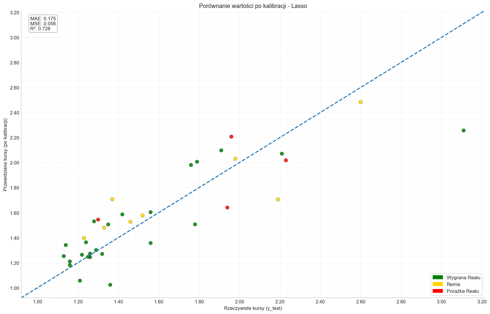

**Analiza:** Model LassoCV prezentuje się bardzo solidnie. Punkty układają się blisko linii trendu, co potwierdza jego wysoką skuteczność. Widać jednak tendencję do zaniżania predykcji dla bardzo wysokich kursów (powyżej 2.50) – model jest nieco zbyt "ostrożny" w ocenie meczów, w których Real nie jest faworytem. Zdarzają mu się również skrajnie niskie predykcje (<1.0), co jest artefaktem statystycznym wymagającym korekty w praktycznym zastosowaniu.

##### **Model ElasticNetCV**

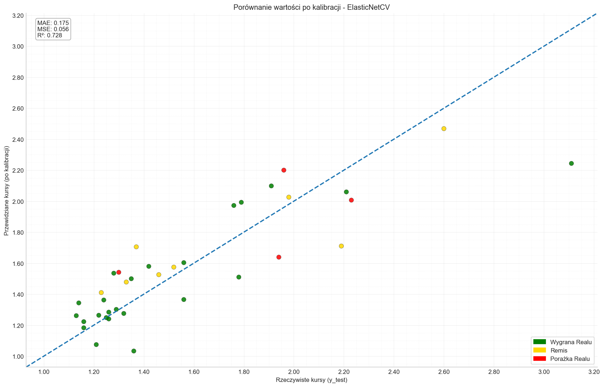

**Analiza:** Wykres dla ElasticNetCV jest niemal bliźniaczo podobny do LassoCV, co potwierdza wnioski z analizy metryk i symulacji biznesowej. Oba modele działają w bardzo zbliżony sposób, wykazując te same mocne strony i ograniczenia. Również tutaj widoczna jest dobra ogólna trafność, ale i problemy z przewidywaniem skrajnych wartości.

##### **Model Złożony (Lasso + Random Forest + RidgeCV)**

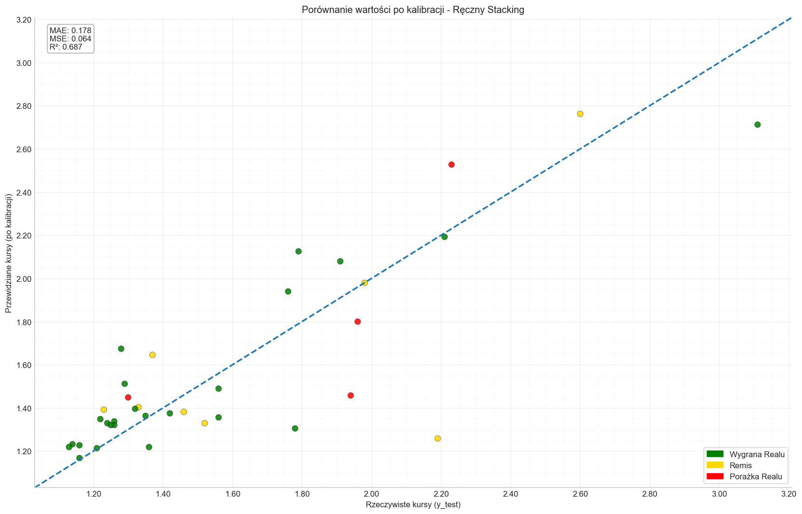

**Analiza:** Model Złożony, mimo nieco lepszych metryk statystycznych, wizualnie prezentuje się słabiej. Rozrzut punktów jest większy, co oznacza, że jego predykcje są mniej stabilne. Ma on jednak jedną, istotną zaletę: **lepiej radzi sobie z interpretacją niskich kursów**. Żadna z jego predykcji nie spada poniżej 1.10, co jest bardziej realistycznym odzwierciedleniem rynku bukmacherskiego.

> Wspólny problem wszystkich modeli: skrajne przypadki (gdy Real nie jest faworytem) są niedoszacowane — to rzadkie zdarzenia w zbiorze.

**Ogólne wnioski z wizualizacji:**
Wykresy potwierdzają, że **LassoCV i ElasticNetCV są bardziej wiarygodnymi i stabilnymi modelami**. Model Złożony, choć unika nierealistycznie niskich predykcji, jest ogólnie mniej precyzyjny. Problemem wspólnym dla wszystkich modeli jest niedoszacowanie kursów w meczach, gdzie Real jest skazywany na porażkę. Prawdopodobnie wynika to z niewielkiej liczby takich spotkań w zbiorze treningowym, co utrudnia modelom naukę wzorców dla tak rzadkich zdarzeń.

### **5. Studium Przypadków: Analiza Błędnych Predykcji**

> Analizuj błędy „kontekstowe” osobno od „statystycznych” — te pierwsze wymagają wiedzy eksperckiej, drugie można adresować inżynierią cech.

Każdy model, nawet najdokładniejszy, ma swoje "martwe punkty" – scenariusze, w których jego logika zawodzi. Zrozumienie, kiedy i dlaczego dochodzi do błędów, jest cenniejsze niż sama wiedza o jego ogólnej skuteczności. Pokazuje to granice możliwości modelu i uczy, jak interpretować jego wyniki z odpowiednią dozą krytycyzmu.

W pierwszej części tej sekcji przeanalizujemy błędy **Modelu Złożonego**, aby zilustrować, jak algorytmy zawodzą w konfrontacji z czynnikami kontekstowymi. W drugiej, przyjrzymy się ekstremalnej predykcji znacznie lepszego modelu **ElasticNetCV**, aby zrozumieć, jakie mechanizmy statystyczne mogą prowadzić do nierealistycznych wyników.

#### **Część 1: Błędy Kontekstowe na Przykładzie Modelu Złożonego**

Analiza skupi się na **Modelu Złożonym**, ponieważ jego błędy, ze względu na bardziej skomplikowaną strukturę, są często większe i bardziej pouczające. Na wykresie poniżej zaznaczono identyfikatory (ID) poszczególnych meczów na zbiorze testowym.

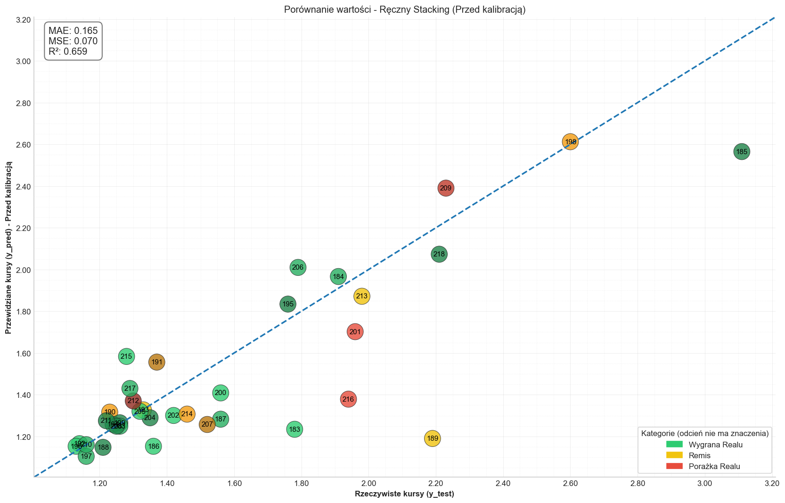

Do szczegółowej analizy wybrano cztery przypadki, które reprezentują różne typy błędów popełnianych przez model:

* **ID 183:** Największa pomyłka przy meczu wygranym przez Real.
* **ID 189:** Największa pomyłka przy meczu zremisowanym.
* **ID 216:** Znacząca pomyłka przy meczu przegranym.
* **ID 215:** Rzadki przypadek, gdzie model znacząco zawyżył kurs.

---

##### **Przypadek 1: Mecz z RCD Mallorca (ID 183)**

* **Spotkanie:** RCD Mallorca vs Real Madryt, 13.04.2024 (Wygrana Realu 1:0)
* **Kurs rzeczywisty:** 1.78
* **Predykcja modelu:** **1.23** (Błąd: -0.55)

**Problem:** Model drastycznie nie doszacował trudności tego wyjazdowego spotkania. Aby zrozumieć dlaczego, porównajmy dane z tego meczu z innym spotkaniem o podobnym kursie rzeczywistym – wyjazdowym meczem z Realem Sociedad (ID 195).

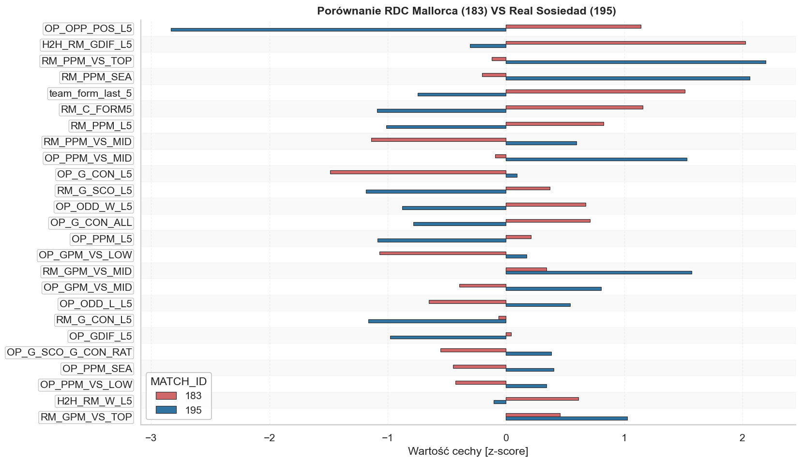

**Analiza:** Z perspektywy danych statystycznych, Real przystępował do tego spotkania w fenomenalnej formie: wysokie oceny pomeczowe (`team_form_last_5`), świetne wyniki punktowe i korzystna historia H2H. Model, bazując na tych przesłankach, słusznie ocenił siłę sportową zespołu jako bardzo wysoką.

**Czego model nie widział? Kluczowy był kontekst.** Mecz ten był rozgrywany **pomiędzy dwoma arcytrudnymi spotkaniami ćwierćfinałowymi Ligi Mistrzów przeciwko Manchesterowi City**. Był to klasyczny "mecz pułapka", w którym priorytetem było oszczędzanie sił kluczowych zawodników (na ławce usiedli m.in. Vinícius, Carvajal i Kroos). Modelowi umknął czynnik ludzki i strategiczny, który był ważniejszy niż jakakolwiek historyczna statystyka.

---

##### **Przypadek 2: Mecz z Villarreal CF (ID 189)**

* **Spotkanie:** Villarreal CF vs Real Madryt, 19.05.2024 (Remis 4:4)
* **Kurs rzeczywisty:** 2.19
* **Predykcja modelu:** **1.19** (Błąd: -1.00)

**Problem:** To największy błąd modelu w całym zbiorze testowym. Algorytm ocenił szanse Realu jako bardzo wysokie, podczas gdy rynek postrzegał to spotkanie jako znacznie bardziej wyrównane.

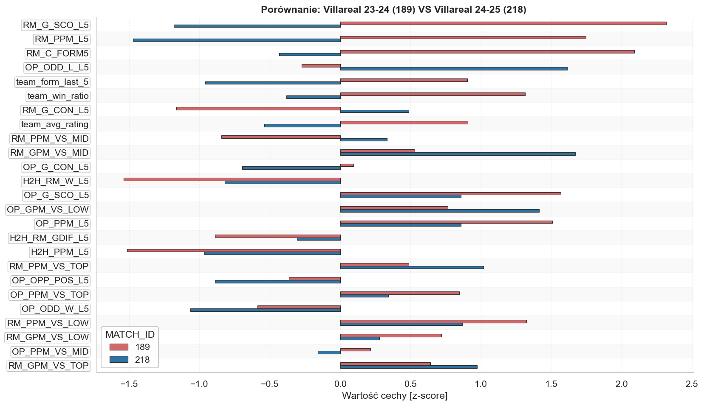

**Analiza:** Zestawienie danych nie pozostawia złudzeń. Real Madryt z sezonu 2023/24 (ID 189) był statystycznie drużyną znacznie potężniejszą niż w sezonie późniejszym (ID 218). Z tej perspektywy predykcja modelu na poziomie 1.19 była w pełni uzasadniona.

**Czego model nie widział? Stawki meczu.** Spotkanie to odbywało się w przedostatniej kolejce, gdy **Real Madryt miał już zapewnione mistrzostwo Hiszpanii**, a jego myśli krążyły wokół zbliżającego się finału Ligi Mistrzów. Dla obu drużyn był to mecz bez większej wagi, co zaowocowało "piknikową" atmosferą i wynikiem 4:4. Dla algorytmu był to kolejny mecz ligowy, podczas gdy dla ludzi był to mecz o "pietruszkę", co rynek bukmacherski trafnie wycenił.

---

##### **Przypadek 3: Mecz z Realem Betis (ID 216)**

* **Spotkanie:** Real Betis vs Real Madryt, 01.03.2025 (Porażka Realu)
* **Kurs rzeczywisty:** 1.94
* **Predykcja modelu:** **1.38** (Błąd: -0.56)

**Problem:** Podobnie jak w poprzednich przypadkach, model nie doszacował trudności wyjazdowego starcia. Tym razem przyczyna leży jednak również w interpretacji samych danych.

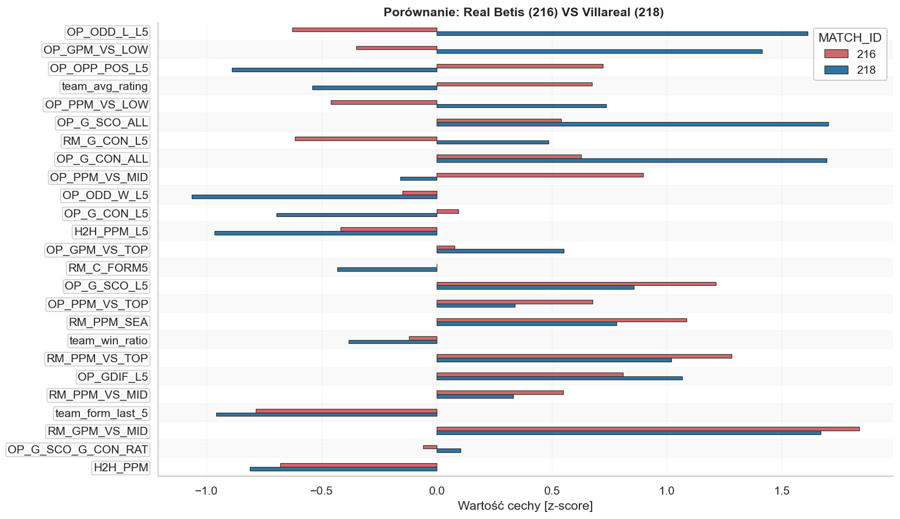

**Analiza:** Największe różnice w danych dotyczą statystyk przeciwnika. W szczególności cecha `OP_ODD_L_L5` (średni kurs na porażkę rywala w ostatnich 5 meczach) miała dla Betisu znacznie niższą wartość. Model zinterpretował to jako "ten zespół grał ostatnio z łatwiejszymi przeciwnikami, więc jest słabszy". To pokazuje, że terminarz może być mylący, a model, zamiast ocenić realną siłę Betisu, mógł zostać "zmylony" przez jego niedawnych rywali.

---

##### **Przypadek 4: Mecz z Gironą FC (ID 215)**

* **Spotkanie:** Real Madryt vs Girona FC, 23.02.2025 (Wygrana Realu)
* **Kurs rzeczywisty:** 1.28
* **Predykcja modelu:** **1.58** (Błąd: +0.30)

**Problem:** To rzadki przypadek, gdzie model znacząco przeszacował ryzyko, przewidując znacznie wyższy kurs niż rynek.

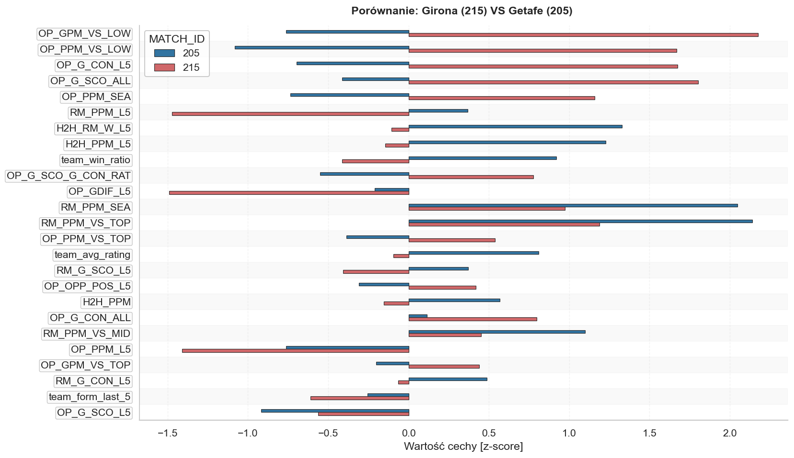

**Analiza:** Przyczyną błędu wydaje się być **"efekt pamięci"** modelu. Girona w sezonie 2023/24 była rewelacją rozgrywek. Model, widząc dane Girony, mógł "pamiętać" jej fenomenalną formę z przeszłości i potraktować ją jako rywala z absolutnego topu, mimo że jej aktualna dyspozycja była znacznie słabsza. Nałożyła się na to również nieco gorsza forma samego Realu, co w połączeniu doprowadziło do nieuzasadnionego zawyżenia kursu.

#### **Część 2: Analiza Statystyczna Ekstremalnej Predykcji Modelu ElasticNetCV**

> [!NOTE]
> Predykcje przed kalibracją mogą sporadycznie spadać < 1.00 — to sygnał do nałożenia bezpiecznych ograniczeń przy wdrożeniu.

Modele Lasso i ElasticNetCV, choć znacznie lepsze, również nie są wolne od błędów. Czasem generują one predykcje, które są niemożliwe w rzeczywistości (np. kurs poniżej 1.00). Poniższa analiza skupi się na jednym z takich przypadków, aby zrozumieć, jakie mechanizmy statystyczne wewnątrz modelu prowadzą do tak skrajnych wyników.

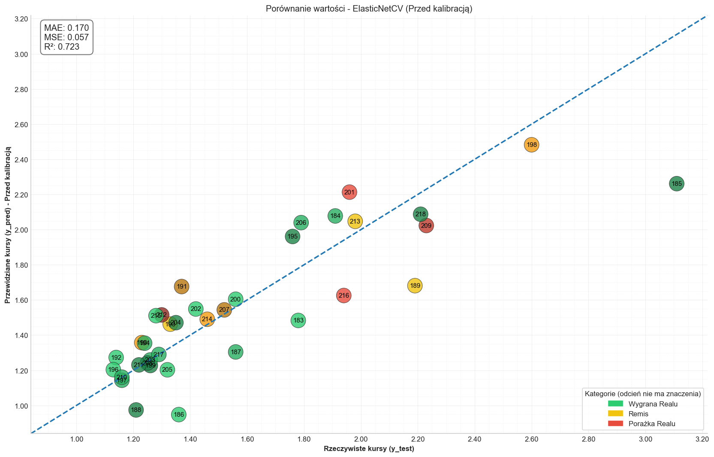

##### **Przypadek 5: Mecz z Cádiz CF (ID 186)**

* **Spotkanie:** Real Madryt vs Cádiz CF, 04.05.2024 (Wygrana Realu 3:0)
* **Kurs rzeczywisty:** 1.36
* **Predykcja modelu:** **0.95** (Błąd: -0.41)

**Problem:** Dlaczego stabilny i skuteczny model, jakim jest ElasticNetCV, wygenerował nierealistycznie niski kurs? Analiza tego przypadku pozwoli nam "zajrzeć do głowy" algorytmu. Porównamy to spotkanie z domowym meczem przeciwko Leganés (ID 204), który miał podobny kurs rynkowy.

###### **Wykres 1: Ogólne porównanie cech (Cadiz vs Leganés)**

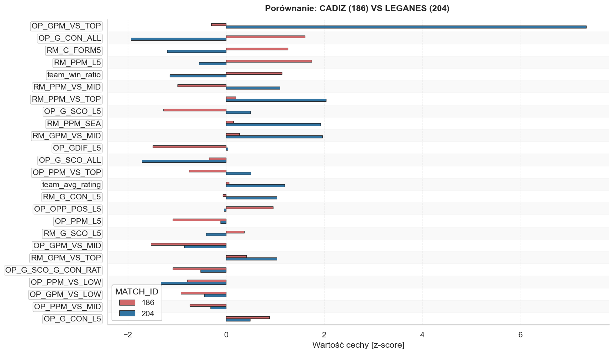

Ten wykres pokazuje, jak bardzo cechy obu przeciwników odbiegały od średniej (wartość z-score). Już na pierwszy rzut oka widać, że Cádiz (czerwone słupki) prezentuje się znacznie gorzej w kluczowych statystykach defensywnych i ofensywnych.

###### **Wykres 2: Najważniejsze czynniki wpływające na predykcję w meczu z Cádiz**

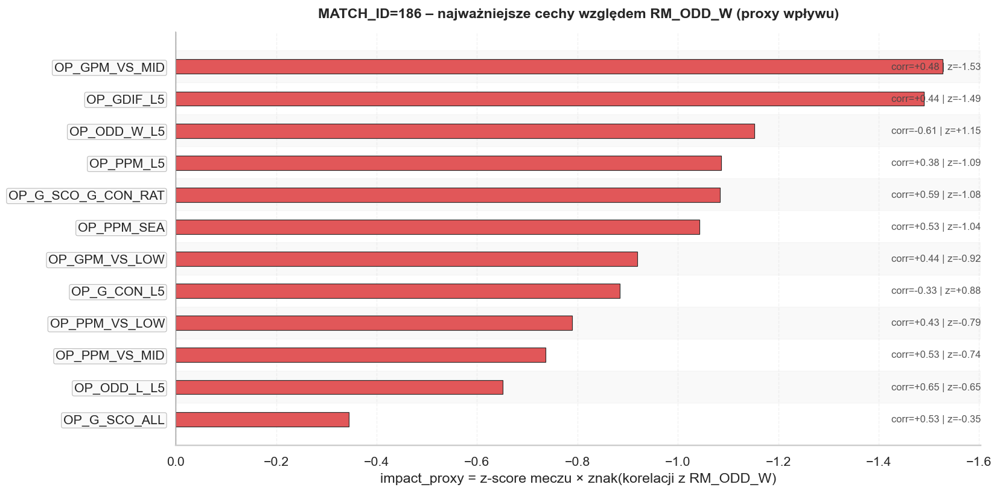

Ten wykres pokazuje, które cechy miały największy negatywny wpływ (obniżający kurs) na predykcję w meczu z Cádiz. Dominują tu wskaźniki opisujące słabość rywala, takie jak `OP_GPM_VS_MID` (mało goli strzelanych drużynom ze środka tabeli) czy `OP_GDIF_L5` (zły bilans bramek w ostatnich 5 meczach).

###### **Wykres 3: Bezpośrednia konfrontacja najważniejszych cech**

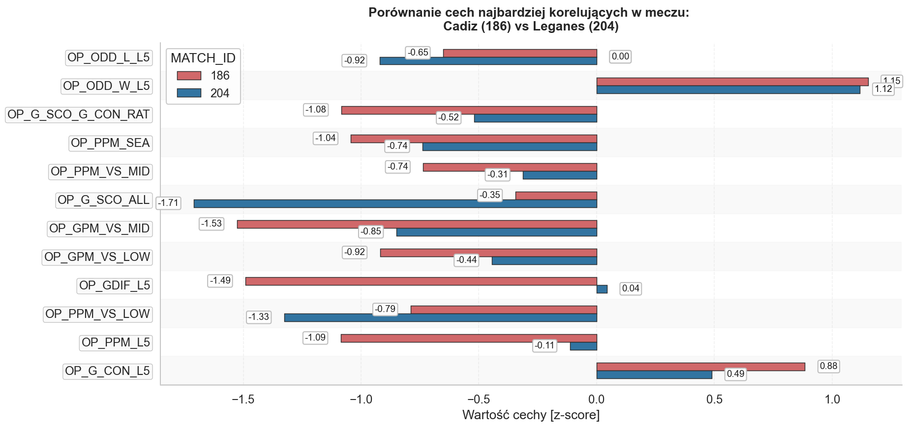

Ten wykres jest ostatecznym dowodem. Porównuje on wartości najważniejszych cech dla obu spotkań. Niemal w każdym kluczowym aspekcie **Cádiz (czerwony) wypada gorzej od Leganés (niebieski)**. Model widział drużynę, która fatalnie punktowała, miała słaby bilans bramkowy i była nisko oceniana przez rynek w poprzednich meczach.

#### **Synteza Analizy Statystycznej:**

Na podstawie tych trzech wykresów można jednoznacznie stwierdzić: **predykcja modelu była z jego perspektywy w pełni logiczna**. Algorytm otrzymał dane o meczu domowym Realu Madryt w świetnej formie przeciwko rywalowi, który statystycznie był jednym z najsłabszych w całej analizowanej próbie. Ekstremalnie negatywne wartości cech dla Cádiz skumulowały się, prowadząc do statystycznie uzasadnionej, ale praktycznie niemożliwej predykcji.

**Ponownie, czego model nie widział? Kontekstu.** Mecz z Cádiz odbywał się pomiędzy półfinałowymi starciami z Bayernem Monachium, a na ławce usiadło aż 6 kluczowych graczy. Rynek bukmacherski uwzględnił ten fakt, podnosząc kurs do 1.36. Model, nieświadomy rotacji, bazował wyłącznie na surowej sile sportowej obu ekip, co doprowadziło do ekstremalnego wyniku. To doskonały przykład, jak nawet najlepszy model statystyczny musi być korygowany przez ludzką wiedzę o czynnikach pozasportowych.

### **6. Wnioski i Rekomendacje**

Przeprowadzona analiza dostarczyła szeregu cennych informacji nie tylko na temat skuteczności poszczególnych modeli, ale również na temat samej natury predykcji sportowych. W tej ostatniej sekcji zbierzemy najważniejsze wnioski i przedstawimy rekomendacje dotyczące zarówno dalszego rozwoju modeli, jak i ich praktycznego wykorzystania w obecnej formie.

#### **6.1. Podsumowanie Wyników**

>> Najlepszy kompromis dokładność/interpretowalność: LassoCV i ElasticNetCV (R² ≈ 0.72) + wartość ocen eksperckich RealMadryt.PL.

Analiza porównawcza jednoznacznie wskazała, że **modele liniowe z regularyzacją – LassoCV oraz ElasticNetCV – okazały się najskuteczniejszymi i najbardziej niezawodnymi narzędziami** do predykcji kursów na mecze Realu Madryt. Osiągnęły one bardzo zbliżone, wysokie wyniki zarówno w ocenie statystycznej (R² ≈ 0.72), jak i, co ważniejsze, w symulacji biznesowej. Ich zdolność do inteligentnej selekcji najważniejszych cech oraz stabilność predykcji sprawiły, że konsekwentnie przewyższały one bardziej złożoną architekturę hybrydową.

Co kluczowe, analiza potwierdziła ogromną wartość unikalnych danych, takich jak **eksperckie oceny redaktorów RealMadryt.PL**, które model LassoCV zidentyfikował jako jeden z siedmiu najważniejszych czynników predykcyjnych.

#### **6.2. Zidentyfikowane Ograniczenia Modeli**

Żaden model nie jest doskonały. Dogłębna analiza błędów pozwoliła precyzyjnie zidentyfikować jego kluczowe ograniczenia, które mają wspólne źródło: **brak zrozumienia kontekstu sytuacyjnego**, który jest naturalną domeną ludzkiej analizy. Główne słabości to:

* **Brak świadomości kontekstu meczowego:** Model nie rozróżnia meczu ligowego od spotkania rozgrywanego między kluczowymi starciami w Lidze Mistrzów. Nie wie, kiedy trener decyduje się na rotacje w składzie, a kiedy gra o najwyższą stawkę.
* **Ignorowanie stawki spotkania:** Algorytm traktuje tak samo mecz o mistrzostwo w ostatniej kolejce, jak i spotkanie o "pietruszkę", gdy losy tytułu są już rozstrzygnięte.
* **Wrażliwość na dane historyczne:** Model może przeszacowywać siłę rywali, którzy mieli jeden wybitny sezon w przeszłości ("jednosezonowe gwiazdy"), nawet jeśli ich obecna forma jest znacznie słabsza.
* **Brak informacji o składach i kontuzjach:** Model bazuje na danych dostępnych przed meczem, ale nie uwzględnia kluczowej informacji, jaką jest ostateczny skład wyjściowy.

#### **6.3. Rekomendacje na Przyszłość**

Zidentyfikowane ograniczenia nie dyskwalifikują modeli, a jedynie wskazują kierunki dalszego rozwoju oraz definiują ramy ich obecnego zastosowania.

**1. Potencjalne Ulepszenia Modeli:**

* **Wzbogacenie o cechy czasowe:** Najprostszym i najefektywniejszym krokiem w celu częściowego zaadresowania problemu kontekstu jest dodanie cech informujących o obciążeniu meczowym. Zmienne takie jak **"liczba dni od ostatniego meczu"** oraz **"liczba dni do następnego meczu"** mogą dać modelowi sygnał o intensywnym okresie w kalendarzu, co często wiąże się z rotacjami.
* **Ważenie danych historycznych:** Aby ograniczyć problem "pamięci historycznej", można wprowadzić mechanizm, w którym nowsze dane (np. z bieżącego sezonu) mają większą wagę niż te z lat poprzednich.

**2. Rekomendowane Zastosowanie w Praktyce:**
Najważniejszym wnioskiem z całej analizy jest fakt, że stworzone modele **nie powinny być traktowane jako autonomiczna wyrocznia, lecz jako zaawansowane narzędzie wspierające pracę analityka**. Jego największą siłą jest zdolność do obiektywnego przetworzenia setek danych i dostarczenia bezstronnej, bazowej oceny prawdopodobieństwa.

> Model hybrydowy „człowiek + maszyna”: algorytm daje bazę statystyczną, ekspert wnosi kontekst (rotacje, stawka, absencje).

Rekomendowany sposób użycia to **model hybrydowy: człowiek + maszyna**:

* **Model dostarcza obiektywną, statystyczną predykcję**, która stanowi punkt wyjścia do analizy.
* **Analityk (redaktor, ekspert)** konfrontuje tę predykcję ze swoją wiedzą na temat **kontekstu**, którego model nie jest w stanie przetworzyć: planowanych rotacji, wagi meczu, atmosfery wokół drużyny czy kluczowych absencji.

Taka synergia pozwala połączyć to, co najlepsze w obu światach: **zdolność maszyny do beznamiętnej analizy danych oraz unikalną, ludzką zdolność do rozumienia niuansów i czynników strategicznych**. W ten sposób predykcje stają się nie tylko dokładniejsze, ale i znacznie bardziej wiarygodne.
